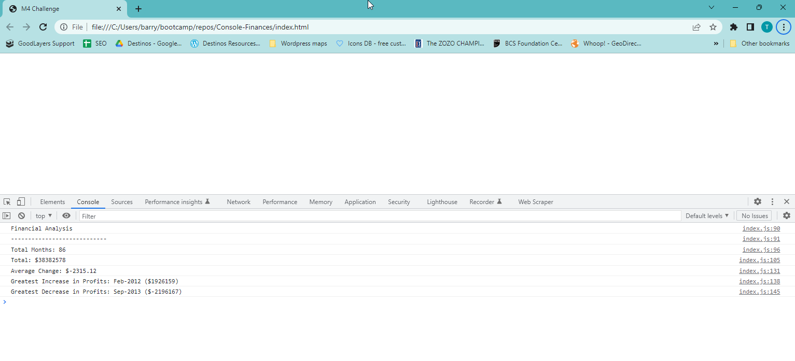

# Console-Finances

## Description

This project was created to analyse the profit and loss of a business by month, to help track the businesses performance. It can be used to help the business improve it's performance by making decisions based on the information produced.

I learned a huge amount, including .map .reduce, improved my knowledge of for loops, how to do max and min and more.

Link to deployed application: https://barrymoore1990.github.io/Console-Finances/

Link to Github: https://github.com/barrymoore1990/Console-Finances

## Table of Contents (Optional)

If your README is long, add a table of contents to make it easy for users to find what they need.

- [Installation](#installation)
- [Usage](#usage)
- [Credits](#credits)
- [License](#license)

## Installation

Clone index.html and index.js into the same folder

## Usage

To use, load index.html into Google Chrome & open up the console by pressing CTRL+SHIFT+J (on Windows). You should see all data produced in the console

## Credits

Used documentation from a couple of websites where I wasn't sure how to solve a problem. These include:
https://developer.mozilla.org/
https://www.w3schools.com/

I also saw previously answered questions on Stack Overflow which helped point me in the right direction.
https://stackoverflow.com/

## License

MIT License

Copyright (c) [2022] [Barry Moore]

Permission is hereby granted, free of charge, to any person obtaining a copy
of this software and associated documentation files (the "Software"), to deal
in the Software without restriction, including without limitation the rights
to use, copy, modify, merge, publish, distribute, sublicense, and/or sell
copies of the Software, and to permit persons to whom the Software is
furnished to do so, subject to the following conditions:

The above copyright notice and this permission notice shall be included in all
copies or substantial portions of the Software.

THE SOFTWARE IS PROVIDED "AS IS", WITHOUT WARRANTY OF ANY KIND, EXPRESS OR
IMPLIED, INCLUDING BUT NOT LIMITED TO THE WARRANTIES OF MERCHANTABILITY,
FITNESS FOR A PARTICULAR PURPOSE AND NONINFRINGEMENT. IN NO EVENT SHALL THE
AUTHORS OR COPYRIGHT HOLDERS BE LIABLE FOR ANY CLAIM, DAMAGES OR OTHER
LIABILITY, WHETHER IN AN ACTION OF CONTRACT, TORT OR OTHERWISE, ARISING FROM,
OUT OF OR IN CONNECTION WITH THE SOFTWARE OR THE USE OR OTHER DEALINGS IN THE
SOFTWARE.
